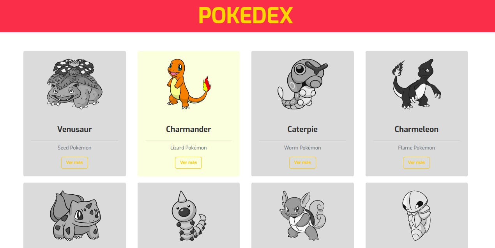
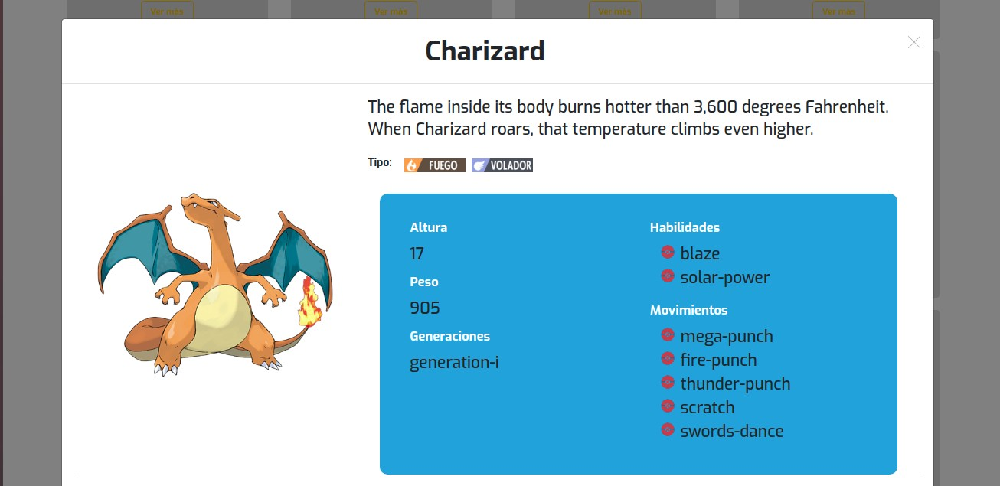

# Pokedex

### Objetivo:
- Crear un pokedex con los conocimientos de Ajax, Jquery y usando la API de pokemon.

### Màs informaciòn del ejercicio

1. Al cargar la página, se debe mostrarse un listado con los nombres de los primeros 20 pokémon.
2. Debe existir un botón llamado '¡Quiero ver más pokémon!' al final del listado que traiga los
   siguientes 20 pokémon.
3. Cada pokémon se debe mostrar en una tarjeta de Bootstrap.
4. Junto al nombre de cada pokémon, debe existir un botón llamado '¡Quiero saber más de este
   pokémon!' para ver más información del pokémon.
5. Al hacer click sobre el botón '¡Quiero saber más de este pokémon!', se debe desplegar un modal
   con la siguiente información: Nombre, tipo, generaciones (obtenidas a partir de la URL del tipo
   de pokémon), habilidades y los primeros 5 movimientos.

### Producto final requerido
-Grilla de Pokemones

-Modal Pokemon

### Pàgina realizada para FullStack DesafioLatam
PierreQ.

